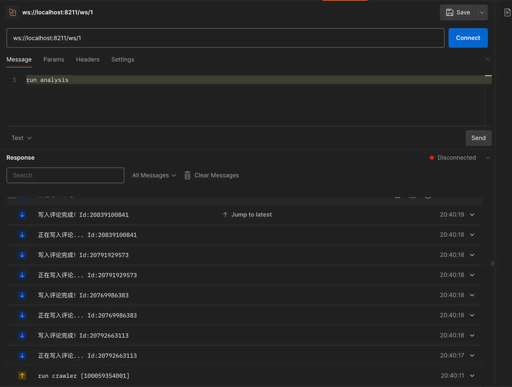
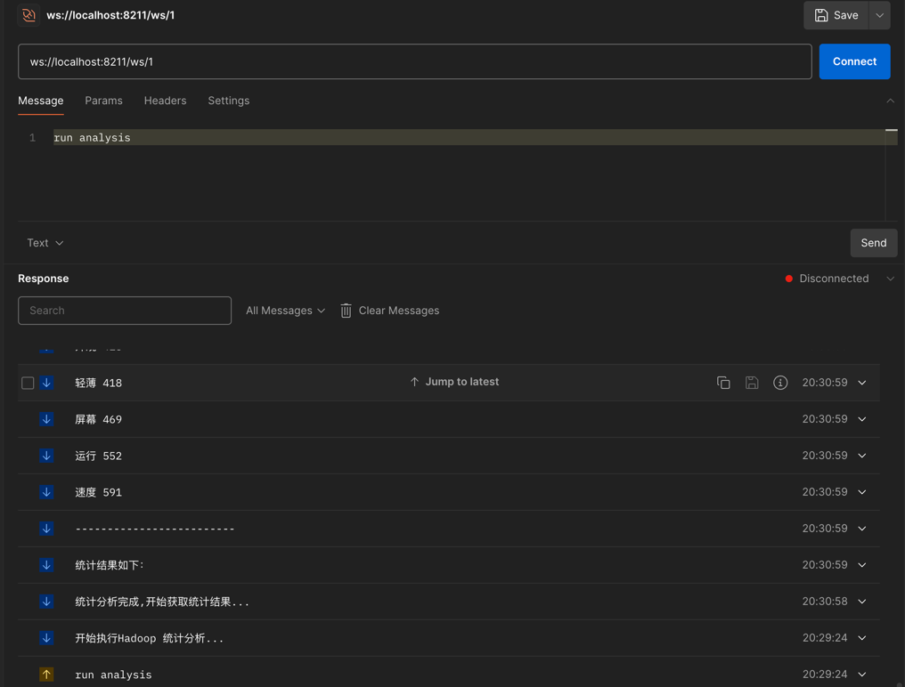

# 说明

&emsp;合肥工业大学软件工程专业《云计算、大数据技术与应用》课程综合设计报告。

&emsp;基于Hadoop+Spring的京东商品评论词频统计系统。

&emsp;爬取京东或淘宝某一商品的评论1000条，统计词频（使用MapReduce或HBase或Hive），并以词云的方式可视化呈现，

## 启动

&emsp;配置`application.yml`文件并运行Spring应用；

&emsp;信息交换采用Websocket协议，链接`ws://localhost:8211/ws/{唯一通信id}`发送以下命令即可执行：

- `run crawler [productionId]`: 爬取指定productionId商品的所有评论；

- `run analyzer`: 启动hadoop对爬取的评论结果进行统计和分析

## 词云效果图

